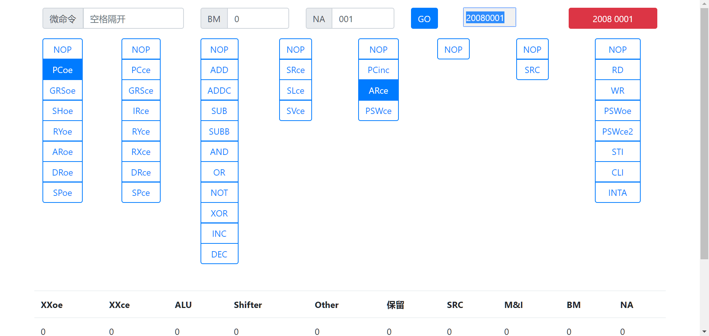

# 微指令编码生成

> 因计算机组成原理课程设计中微指令计算繁琐，当时也不知道老师给了相应的程序，于是写了这个小工具。

## 使用方法

- 浏览器打开 `micro.html` 
- 微命令通过蓝色按钮选择，不选择默认为 `NOP`
- `BM` 和 `NA` 在输入框中输入，分别为**十进制**和**十六进制**
- 点击**右上角红色按钮**即可计算并复制到剪切板

> 微命令的输入框、蓝色GO按钮为第一个版本，不如按钮方便，弃用。

## 界面截图

