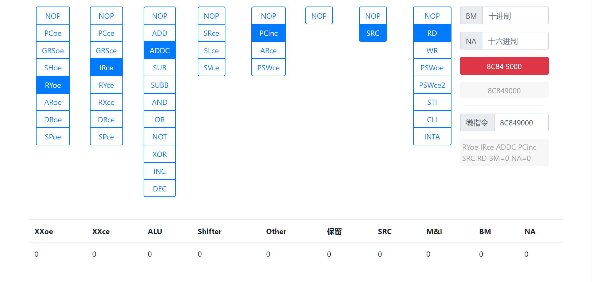

# 微指令编码生成

> 因计算机组成原理课程设计中微指令计算繁琐，当时也不知道老师给了相应的程序，于是写了这个小工具。

## 使用方法

- 浏览器打开 `micro.html` 
- 微命令通过蓝色按钮选择，不选择默认为 `NOP`
- `BM` 和 `NA` 在输入框中输入，分别为**十进制**和**十六进制**
- 点击**红色按钮**即可计算并复制到剪切板

> **微指令转微命令**：微指令输入框中输入微指令，点击输入框左侧 *微指令* 按钮，下方文本框中即为对应的微命令。

## 界面截图

第三版界面

> 第二版界面
> 
