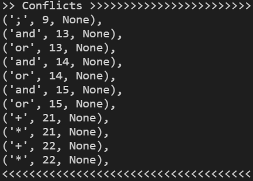
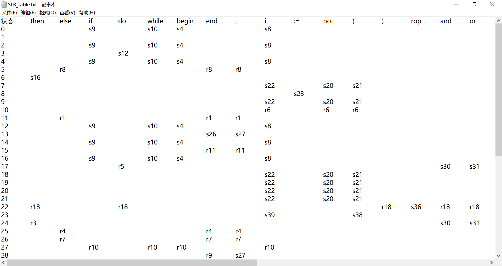
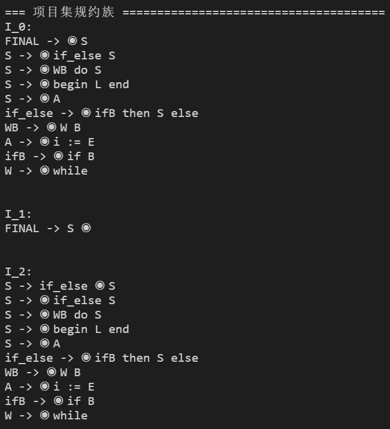

# SLR 分析器

> 根据文法转换成 SLR 分析表

## 使用

- **导入文法**

  - 文法路径配置：`config['GrammarFile']`。

  - 文法文件填写规则：文法一行一条；关键词以 *空格* 隔开，箭头也用 *空格* 替代。[【例: exp.txt】](./exp.txt)

  - 文法需为拓广后的文法，不含 `|` ，且第 0 条表达式形如 `S'->S`。

- **配置冲突**

  - 有的文法存在“移进/规约”冲突，运行程序后会打印下图所示的冲突列表。

    

  - 需将各个冲突复制到 `config['LeftCombs']` 中，对所有第三项为 `None` 的冲突手动配置。冲突信息的三项内容为：`(当前处理的字符，拟规约的表达式，是否为左结合)`.
  
  - 如冲突 `('*', 21, None)`，对于表达式 21（`E -> E + E`）在 `E + E` 之后遇到字符 `'*'` ，因 `'*'` 优先级高于  `'+'`，所以是右结合，将第三项修改为 `False`：`('*', 21, False)`。

## 截图





## Markabaka

### NSet - 构造 First、Follow 集

**First**、**Follow** 集的构造时需要让某个集合 `A` 拥有另一个集合 `B` 的全部元素，此时将 `B` 的元素加到 `A` 中，然后集合 `B` 有可能又会增加，因此需要不断循环至没有新增元素，比较麻烦。

在这里，使用 **`NSet`** 来存储各个集合，`NSet` 中除了实际存储元素的集合 `_set` 之外，还有一个列表 **`listeners`** 来存储那些包含自己所有元素的 `NSet`。

当 `NSet` 添加元素时会向自己的所有 `listeners` 广播，使 `listeners` 添加自己的元素；添加元素时会先判断元素是否已存在于集合，如果没有新元素则不进行广播，避免广播风暴。

```python
class NSet():
    def __init__(self):
        self._set = set()
        self.listeners = []  # 自己有的，listeners 都要有

    def add(self, newItems):
        if not isinstance(newItems, Iterable):
            newItems = [newItems]

        hasNew = False
        for item in newItems:
            if item not in self._set:
                hasNew = True
                self._set.add(item)
        if hasNew:
            self.broadcast()

    def addListener(self, other):
        if other == self:
            return
        if other not in self.listeners:
            self.listeners.append(other)
            other.add(self._set)

    def broadcast(self):
        for listener in self.listeners:
            listener.add(self._set)
```
